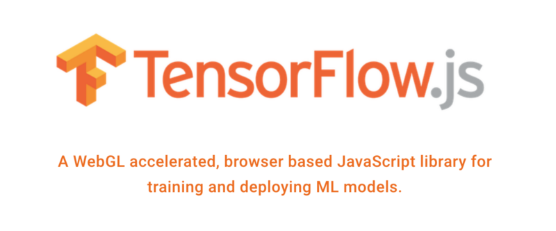

# tfjs-mobilenet-offline-model
This is an offline version of [MobileNet](https://github.com/tensorflow/models/blob/master/research/slim/nets/mobilenet_v1.md) pre-trained model for [TensorFlow.JS](https://www.tensorflow.org/js) for use with the Node.JS version of the library

## What is this?

This is a downloaded version of the pre-trained MobileNet model, that can be used with TensorFlow.JS library either in the browser or using Node.JS.

Instructions for downloading the mode configuration file and mode weights can be found here: http://jamesthom.as/blog/2018/08/07/machine-learning-in-node-dot-js-with-tensorflow-dot-js/

_(Scroll down until you find the `MobileNet Models` section)_

Kudos to [James Thomas](https://about.me/j_thomas)

## Versions uploaded

- v1_1.0_224

## Step-by-step process of downloading the files

`$ brew install jq`

`$ brew install parallel`

`$ curl https://storage.googleapis.com/tfjs-models/tfjs/mobilenet_v1_1.0_224/model.json > mode.json`

`$ cat model.json | jq -r ".weightsManifest[].paths[0]" | sed 's/^/https:\/\/storage.googleapis.com\/tfjs-models\/tfjs\/mobilenet_v1_1.0_224\//' |  parallel curl -O`